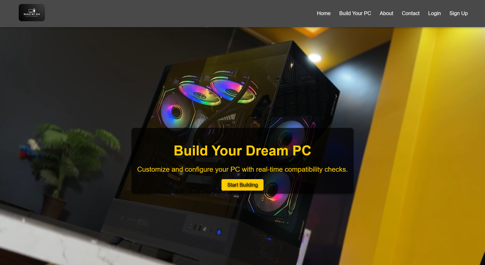

# PcBuild

[GitHub Repository](https://github.com/RX-N/PcBuild/tree/main)

## Overview
PcBuild is a mini-project designed to assist users in planning and visualizing their PC builds. With a focus on ease of use and flexibility, this project includes multiple features aimed at simplifying the process of selecting and matching PC components.

## Table of Contents
- [Features](#features)
- [Installation](#installation)
- [Usage](#usage)
- [Screenshots](#screenshots)
- [Contributing](#contributing)
- [License](#license)

## Features
- **Component Compatibility Checker:** Ensure the selected components are compatible with each other.
- **Interactive Design:** User-friendly interface with interactive elements for better engagement.
- **Image Gallery:** Display images of components to help users visualize their builds.
- **Responsive Layout:** Adaptable design for both desktop and mobile views.

## Installation
To get a local copy up and running, follow these steps.

1. **Clone the repository:**
    ```bash
    git clone https://github.com/RX-N/PcBuild.git
    ```
2. **Navigate to the project directory:**
    ```bash
    cd PcBuild
    ```
3. **Install dependencies:**
    ```bash
    npm install
    ```

## Usage
Start the server and open your browser to view the project.

1. **Run the application:**
    ```bash
    node server.js
    ```
2. **Open your browser and navigate to:**
    ```
    http://localhost:3000
    ```

## Screenshots


## Contributing
Contributions are what make the open source community such an amazing place to learn, inspire, and create. Any contributions you make are **greatly appreciated**.

1. Fork the Project
2. Create your Feature Branch (`git checkout -b feature/AmazingFeature`)
3. Commit your Changes (`git commit -m 'Add some AmazingFeature'`)
4. Push to the Branch (`git push origin feature/AmazingFeature`)
5. Open a Pull Request

## License
Distributed under the MIT License. See [LICENSE](./LICENSE) for more information.
